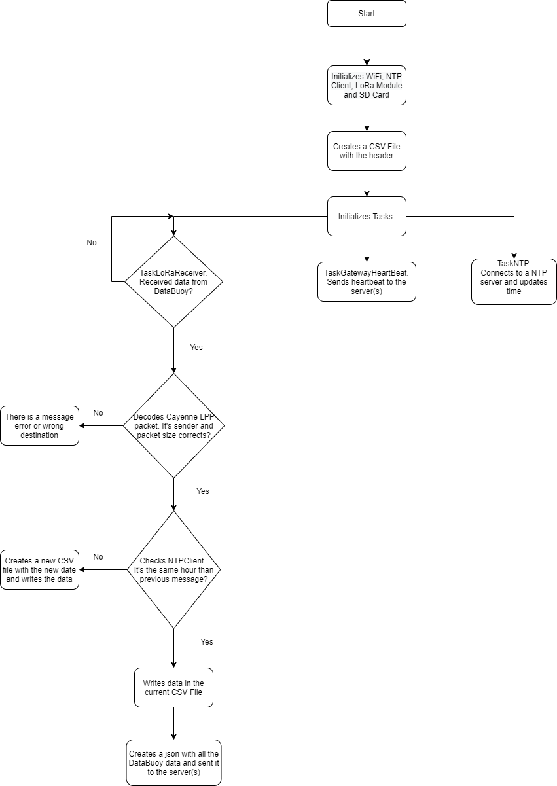

# LoPy4 Gateway
 
The Lopy4 gateway receives the data from the DataBuoy and sending it to the server. Communication with the DataBuoy is performed using the LoRa protocol and the data is sent to the server via the MQTT protocol or by http request. The data is communicated by the DataBuoy once every minute (default), which is transmitted immediately if the gateway is connected to the internet and to the server. 

## Code Structure
The code is structured in different tasks with different functions.

### Task LoRaReceiver 
Task responsible for receiving data from the DataBuoy. The data is transmitted through the Cayenne LPP and decoded at the gateway, saved in a CSV file and sent in JSON format to the server(s).

### Task GatewayHeartBeat
This task is responsible for sending to the server a periodic heartbeart (default: 15 seconds).

### Task NTP
Connects to a NTP server and updates the timestamp (default: 1ms).

## Code Structure Flowchart
 

  

