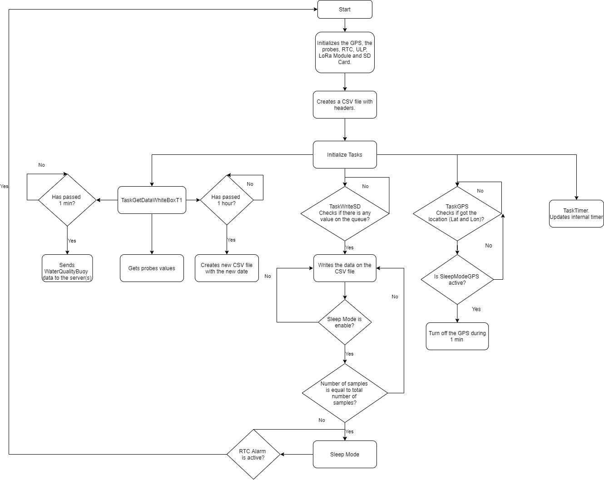

# LoPy4 WaterQualityBuoy
 
The Lopy4 WaterQualityBuoy gets the data from the [probes](https://atlas-scientific.com/), a certain sample rate. The system is prepared to read multiple probes (pH, ORP, DO, EC and RTD). To connect the probes to the LoPy4 is used a [shield](https://www.whiteboxes.ch/shop/whitebox-t1/) and a custom pcb. The averages of these variables are calculated, among others, and sent to the gateway every minute (default) through the LoRa protocol. The WaterQualityBouy can operate in continuous mode or in sleeping mode. In sleep mode, LoPy4 wakes up in certain minutes and takes readings before falling asleep. The RTC sends the alarm signal to the ULP which in turn wakes up the LoPy4 ESP32.

## Code Structure
The code is structured in different tasks with different functions.

### Task TaskGetDataWhiteBoxT1 
Task responsible for collecting the data from the probes, calculating their averages and sending the package through the LoRa protocol to the gateway.

### Task TaskWriteSD
This task writes the data collected in a csv file. In order not to make the file too heavy, variables are written whenever possible or every second / minute, depending on their degree of importance or rate of change. 

### Task TaskGPS
Gets the GPS Latitude and Longitude. To save battery energy, the GPS can sleep after getting the WaveBuoy location.

### Task TaskTimer
Updates the "internal" timer.

## Code Structure Flowchart
 

  

 