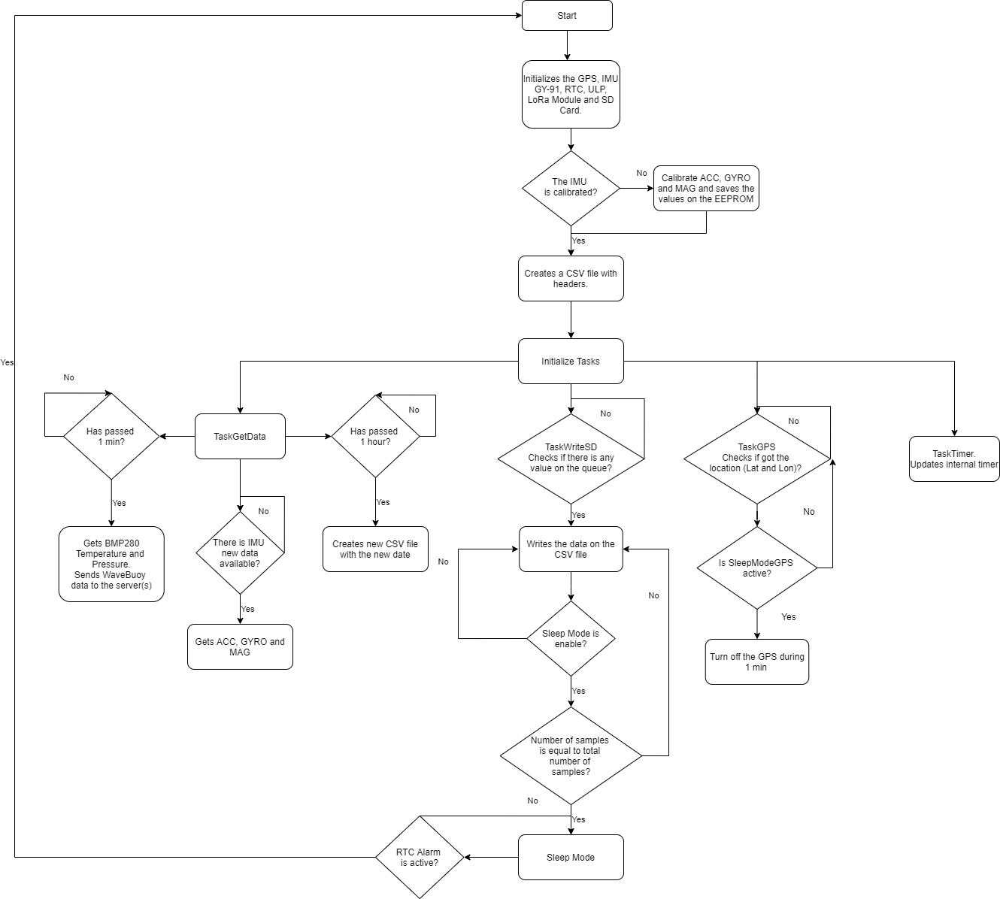
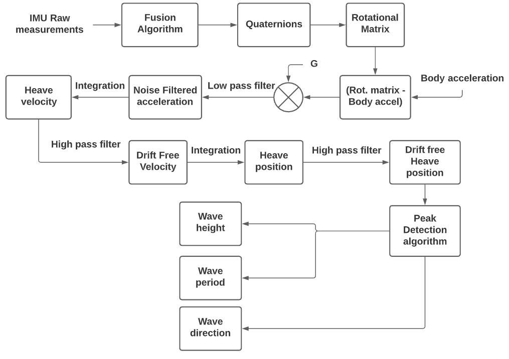

# LoPy4 WaveBuoy
 
The Lopy4 WaveBouy gets the data from the IMU, a certain sample rate, and calculates the distance between the sea wave trough and crest. This value corresponds to the height of the wave and makes it possible to calculate the significant wave value. The averages of these variables are calculated, among others, and sent to the gateway every minute (default) through the LoRa protocol. The WaveBouy can operate in continuous mode or in sleeping mode. In sleep mode, LoPy4 wakes up in certain minutes and takes readings before falling asleep. The RTC sends the alarm signal to the ULP which in turn wakes up the LoPy4 ESP32. It is necessary to perform the calibration of an IMU at least once, since the values are then stored in the EEPROM LoPy4.

## Code Structure
The code is structured in different tasks with different functions.

### Task TaskGetData 
Task responsible for collecting the data from the sensors, calculating the parameters of interest and their averages and sending the package through the LoRa protocol to the gateway.

### Task TaskWriteSD
This task writes the data collected in a csv file. In order not to make the file too heavy, variables are written whenever possible or every second / minute, depending on their degree of importance or rate of change. 

### Task TaskGPS
Gets the GPS Latitude and Longitude. To save battery energy, the GPS can sleep after getting the WaveBuoy location.

### Task TaskTimer
Updates the "internal" timer.

## Code Structure Flowchart
 

  

 

### Wave Height
The wave height was determined using the [madwick filter](https://x-io.co.uk/open-source-imu-and-ahrs-algorithms/) that allows the accelerometer and gyroscope fusion and obtain the IMU orientation. The wave height was obtain through the Z axis acceleration double integration and a peak detection algorithm, allowing to get the speed and consequently the height, as well the period and direction.

## Wave Height Flowchart
 

  

 