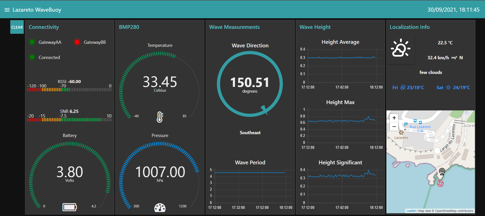

# NodeRed interface

An interface was developed in order to be able to view the data collected by the data buoys. The data is sent every minute (default) and can be viewed in real time or through a MySql database where all the data is stored. It's also possible to export it to a csv file.

## Requirements

It's was used a server with Ubuntu 20.04.2 LTS installed with the following software:

* NodeJS
    * sudo curl -fsSL https://deb.nodesource.com/setup_16.x | sudo -E bash -
    * sudo apt-get install -y nodejs
* MQTT
    * sudo apt-get install mosquitto mosquitto-clients
* MySql
    * sudo apt install mysql-server
    * sudo mysql_secure_installation
        * sudo mysql -u root -p
            * CREATE USER 'user'@'localhost' IDENTIFIED BY 'password';
            * GRANT ALL PRIVILEGES ON *.* TO 'user'@'localhost' WITH GRANT OPTION;
            * ALTER USER 'user'@'localhost' IDENTIFIED WITH mysql_native_password BY 'password';
            * FLUSH PRIVILEGES;
* NodeRed
    * sudo npm install -g --unsafe-perm node-red
        * NodeRed Nodes
            * Dashboard - npm install node-red-dashboard
            * MySql - npm i node-red-node-mysql
            * Compass - npm install node-red-contrib-compass
            * Artless-gauge - npm install node-red-contrib-ui-artless-gauge
            * Led - npm install node-red-contrib-ui-led~
            * Email - npm install node-red-node-email
            * Level - npm install node-red-contrib-ui-level
            * Worldmap - npm install node-red-contrib-web-worldmap
