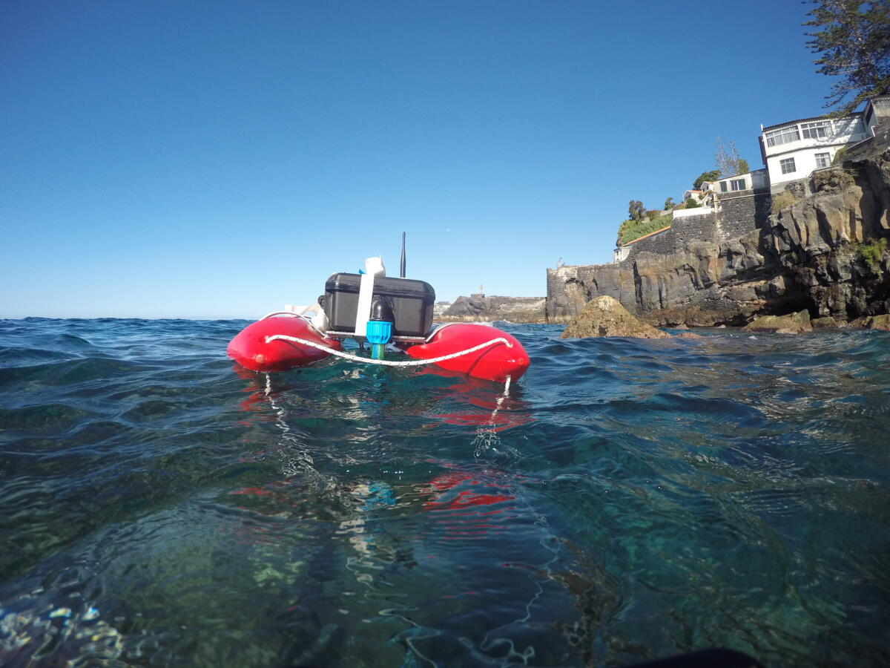

# LoPy4
 
The LoPy4 permits the use of Lora communication protocol. With the communication of data to land, it is possible to show the data in real time. Can be used [MQTT communication protocol](https://mqtt.org/) or/and http request to send the data to a server(s). As a way of viewing the data buoys transmitted information by MQTT is used the [NodeRed tool](https://nodered.org/).

We built two distinct types of data buoys, each with a specific function (WaveBuoy and WaterQualityBuoy). 

As the name indicates, WaveBuoy was developed to measure some parameters of interest for waves, such as their height, significant height, wave period, among others.

WaterQualityBuoy was developed to measure parameters related to the quality of sea water, such as ph, conductivity and temperature. 

## Hardware used on both data buoys
* Buoy
* Waterproof Case
* LoPy4
* 2 x Sunny Buddy Solar Charger
* RTC DS3231
* SD Card reader
* 2 x solar panels
* GPS G403

## Hardware used on the WaveBuoy
* IMU GY-91

## Hardware used on the WaterQualityBuoy
* Tentacle Shield for Arduino
* pH Probe
* Conductivity Probe (EC)
* Oxidation-Reduction Potential Probe (ORP)
* Dissolved Oxygen Probe (DO)
* Temperature (RTD)

