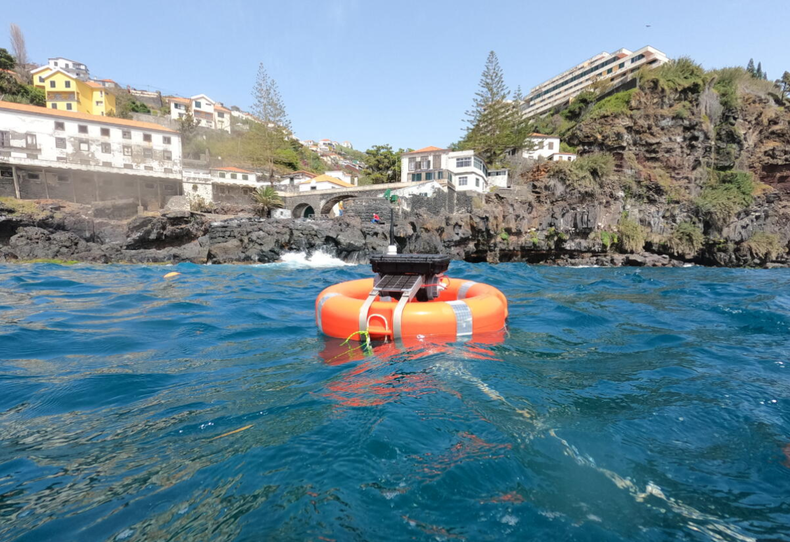

# Data Buoy
 
This is our low-cost data buoy, a remote sensing platform project initiated during the project REDEMA Redesigning Madeira: Using Speculative Design to Rethink Energy Policy and Consumer Behaviour. The buoy currently measures sea state dynamics for ocean wave energy capture; next steps will extend the buoy as a remote sensing platform for a variety of Marine and Coastal Ecosystem Monitoring activities, and release a free and Open Source DIY kit for citizen science in EU Outermost Regions, Overseas Territories, and worldwide Small Island Developing States.

In order to implement any of our designs for wave energy collection in the coastal zone, we need first to be able to monitor and understand the wave dynamics of the coastal zone. To support community ownership of the data and encourage local community-scale renewable energy projects, any data collection system must be affordable. To this effect, we make what is known as a Material Speculation, that is a semi-functional, or in this case, a fully functional physical prototype that facilitates transition to that preferable version of the future.
